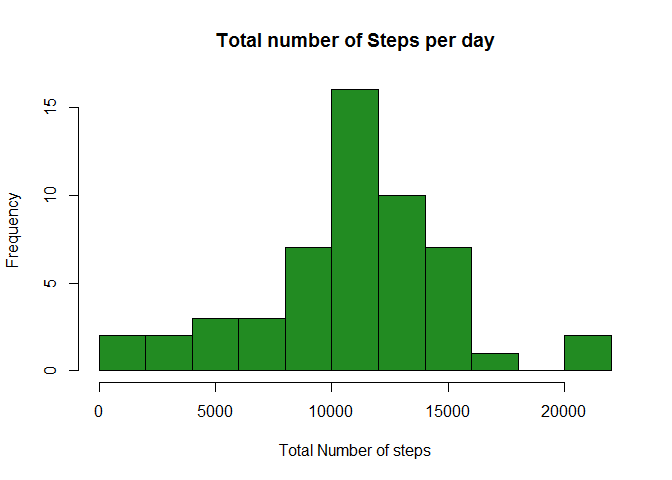
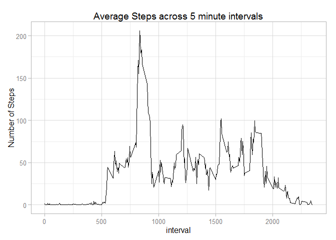
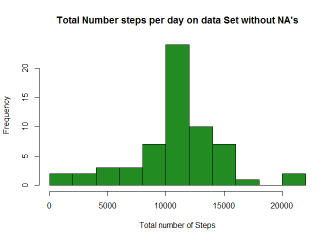
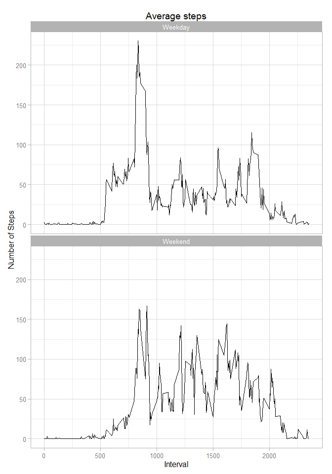

# Reproducible Research: Peer Assignment 1
JHolling  
Tuesday, January 05, 2016  
This R code loads the data file "Activity monitoring data" that contains
a 17,568 observations at 5 minute intervals from October & November 2012.
This data set is about personal movement using activity monitoring 
devices such as a Fitbit.

The R code continues and processes the data to answer various questions
from the John Hopkins Reproducible Research Class.

This data file can be located at: 
<https://d396qusza40orc.cloudfront.net/repdata%2Fdata%2Factivity.zip>

Note: The above mentioned data file will need to be unzipped and placed
in the root of your working directory or use the "setwd" function to a 
set the desired location to the file. 

## Let's Look at the data
#### Begin by Loading data for processing

```r
options(scipen=200)          #stops scientific notation in axis labels
library(ggplot2)
move<-read.csv("activity.csv")
```

## Lets find the mean total number of steps taken per day?
First lets process and plot the data

#### First get the total number of steps taken per day
Generating sum per day

```r
move_day_sum<-aggregate(steps~date,FUN=sum,data=move)
```

#### Plot total number of steps per day

```r
hist(move_day_sum$steps,breaks=10,xlab="Total Number of steps",
main="Total number of Steps per day",
col="forestgreen")
```

 

#### Here is total median & mean of total number of steps taken per day?

```r
median(move_day_sum$steps)
```

```
## [1] 10765
```

```r
mean(move_day_sum$steps)
```

```
## [1] 10766.19
```
## What is the average daily activity pattern?
To answer this question, processing & plotting for more details 

#### Generate Plot time series -Mean 5 minute interval & steps taken, averaged across all days

```r
move_interval_mean<-aggregate(steps~interval,FUN=mean,data=move)

g<-qplot(interval,steps,data=move_interval_mean, geom="line")
    Main.title<-labs(title="Average Steps across 5 minute intervals")
    yname<-ylab("Number of Steps")
    border<-theme_light()

g+Main.title+yname+border
```

 

#### Which 5-minute interval, on average, across all the days, contains the maximum number of steps? 

```r
move_interval_mean[move_interval_mean$step==max(move_interval_mean$steps),1]
```

```
## [1] 835
```

##Inputing missing values

#### How many NA's are in the data set?

```r
summary(move)[7]
```

```
## [1] "NA's   :2304  "
```
The average activity pattern is showing initial activity at around interval 600 
w/50 steps, then the "steps" spike upward at interval 835 to over 200 steps. 
After this interval, the steps drop back down to ~50 to 100 and then tappering 
back off after interval 2000. Overall, the plot is right skewed and has 2304 
NA's observations.

#### Making a new data set from orginal to processes further

```r
move_noNA<-move
```

#### Replace/fill NA's in new data set strategy
The NA's will be replaced with the current interval mean across all the days.

```r
move_noNA$steps[is.na(move$steps)]<-move_interval_mean$steps[match(move$interval,
move_interval_mean$interval)][is.na(move$steps)]
```
#### Plot histogram of new data w/o NA's with total number of steps taken each day

```r
move_noNA_day_sum<-aggregate(steps~date,FUN=sum,data=move_noNA)   
hist(move_noNA_day_sum$steps,breaks=10,xlab="Total number of Steps",
main="Total Number steps per day on data Set without NA's",
col="forestgreen")     
```

 


The new data set w/o the NAs looks in a similar pattern to the original except the mid point is higher due to the "average" interval being applied to the NAs.

#### Calculating the median and mean total for the new data set per day

```r
median(move_noNA_day_sum$steps)    
```

```
## [1] 10766.19
```

```r
mean(move_noNA_day_sum$steps)
```

```
## [1] 10766.19
```
#### What is the differerence for between the two sets of data:

```r
median(move_noNA_day_sum$steps)-median(move_day_sum$steps)
```

```
## [1] 1.188679
```

```r
mean(move_noNA_day_sum$steps)-mean(move_day_sum$steps)
```

```
## [1] 0
```
#### What is the impact of inputting missing data for average interval steps
The new data set witout the NA's replaced several day's worth of NA data. This 
resulted in no difference between median and mean for that data set without NAs. 
The mean for the data set without NAs and the data set with the NA's is also the 
same. 

The only difference noticed is the median sfor data set without the NAs 
went up a small amount compared to the data set with the NAs. This would we
be from the NA's being replaced with the "average interval mean" and will 
raise the steps at the mean and raise the median a bit...towards the mean.

## Are there differences in activity patterns between weekdays and weekends?
Lets process and plot this data set to determine the answer.

#### Create a new factor variable in the dataset with two levels - "weekday" and "weekend" indicating whether a given date is a weekday or weekend.

```r
move_noNA$day <- weekdays(as.Date(move_noNA$date))  
move_noNA$day<-as.factor(ifelse(move_noNA$day == "Sunday" | move_noNA$day == "Saturday","Weekend", "Weekday"))
```
#### Make a panel plot containing a time series plot (i.e. type = "l") of the 5-minute interval (x-axis) and the average number of steps taken, averaged across all weekday days or weekend days (y-axis).


```r
move_noNA_interval_mean<-aggregate(steps~interval+day,data=move_noNA,mean)

g<-qplot(interval,steps,data=move_noNA_interval_mean, geom="line")
    Main.title<-labs(title="Average steps")
    yname<-ylab("Number of Steps")
    xname<-xlab("Interval")
    facet<-facet_wrap(~day,ncol=,2)
    border<-theme_light()

g+Main.title+xname+yname+facet+border
```

 


We can see a definite difference in the Weekday vs Weekend step activity. The plot shows
the Weekend activity starts later (waking up later on weekend?) then the Weekday. 
In addition, the Weekend activity is somewhat constant (more steps) after the
"initial" early hours vs the Weekday dropping off more noticeably after that 
timeperiod. However, the weekend activity "peak" is not as high as the weekday 
"peak".
